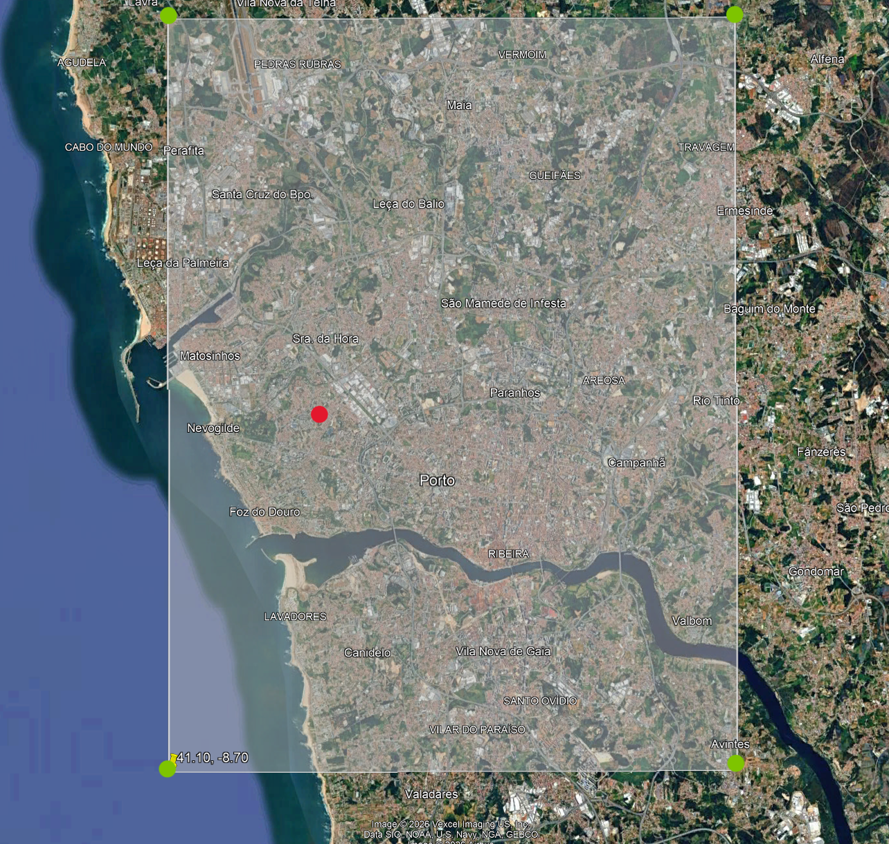

# flight-above

Shows the closest aircraft flying over your location on a HUB75 64x32 LED matrix, driven by an ESP32.

## Content

- `esp32.cpp`: main firmware
- `area.png`: example search area
- `hub75-pinout`: pinout for the HUB75 model used
- `esp32-pinout`: pinout for the ESP32 model used

## What it shows

- Airline name (from callsign)
- Aircraft model
- Origin or destination airport
- Climb/descent arrow
- Speed (kts) and altitude (ft)
- Live data from the Flightradar24 feed, refreshed every 10 s

## Setup

### 1. Set the values

Edit these values at the top of `esp32.cpp`:

| Variable | Description |
|---|---|
| `WIFI_SSID` | Wi-Fi network name (**2.4 GHz only**) |
| `WIFI_PASS` | Wi-Fi password |
| `HOME_LAT` / `HOME_LON` | Your location (red dot), the center used to pick the nearest aircraft |
| `LAMIN` / `LAMAX` | South/North edges of the area |
| `LOMIN` / `LOMAX` | West/East edges of the area |

### 2. Connect the panel

Wire the HUB75 panel to the ESP32 according to the [Pinout](#pinout) table.

- Check `hub75-pinout` and `esp32-pinout` before connecting.
- Join all grounds: panel, ESP32 and power supply.
- Power the panel from its own 5 V supply (4+ A recommended). Do not power it from the ESP32 5V pin or USB source.

### 3. Upload the code

The nearest aircraft should appear within about 10s. If no aircraft is inside your search box, the panel will display "NO FLIGHTS".

## API

Data comes from the Flightradar24 feed, requested every 10s with the bounding area built from `LAMIN`, `LAMAX`, `LOMIN` and `LOMAX`.

## Search area

- **Green dots:** the corners of the search box (`LAMIN`, `LAMAX`, `LOMIN`, `LOMAX`). Only aircraft inside this box are considered.
- **Red dot:** your home / desired tracking center (`HOME_LAT`, `HOME_LON`). The aircraft closest to this point is shown.

## Pinout

| HUB75 pin | ESP32 GPIO |
|---|---|
| R1 | 25 |
| G1 | 26 |
| B1 | 27 |
| R2 | 14 |
| G2 | 32 |
| B2 | 13 |
| A | 23 |
| B | 19 |
| C | 5 |
| D | 17 |
| LAT | 4 |
| OE | 15 |
| CLK | 16 |
| GND | GND |

## Libraries

- ESP32-HUB75-MatrixPanel-I2S-DMA
- ArduinoJson
