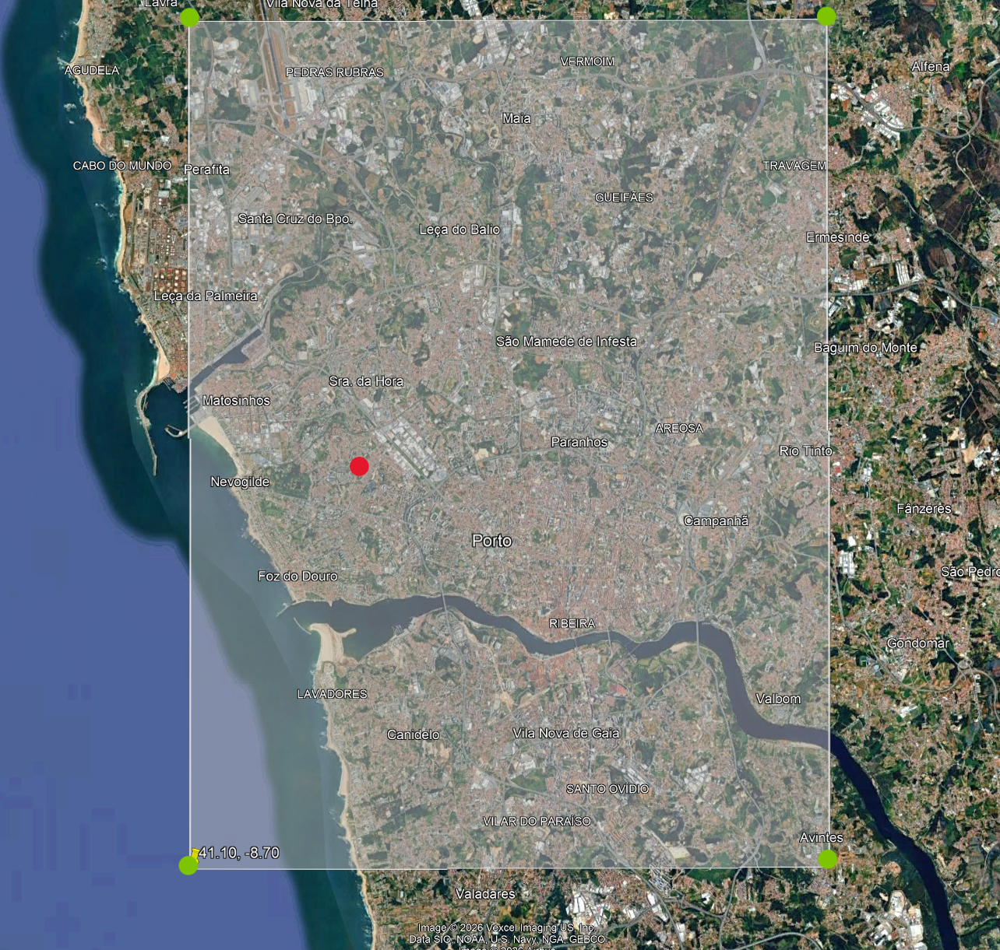

# flight-above

Shows the closest aircraft flying over your location on an ESP32-driven display. Supports both **HUB75 64x32 LED matrices** and **I2C 128x32 OLED displays**.

## Content

- `esp32-HUB75.cpp`: HUB75 software
- `esp32-I2C.cpp`: I2C software
- `area.png`: example search area
- `esp32-pinout`: pinout for the ESP32 model used

## What it shows

- Airline name or callsign
- Aircraft model
- Origin or destination airport
- Climb/descent symbol
- Speed (kts) and altitude (ft)

## Setup

### 1. Choose your software

Select the `.cpp` file corresponding to your display module:
- Use `esp32-HUB75.cpp` if you are using a HUB75 64x32 RGB LED matrix.
- Use `esp32-I2C.cpp` if you are using an I2C 128x32 OLED screen.

### 2. Set these values

Edit these values at the top of your chosen `.cpp` file:

| Variable | Description |
|---|---|
| `WIFI_SSID` | Wi-Fi network name (**2.4 GHz only**) |
| `WIFI_PASS` | Wi-Fi password |
| `HOME_LAT` / `HOME_LON` | Your location coordinates |
| `LAMIN` / `LAMAX` | South/North edges of the bounding area |
| `LOMIN` / `LOMAX` | West/East edges of the bounding area |

### 3. Connect the display

#### Option A: HUB75 Panel
Wire the HUB75 panel to the ESP32 according to the [HUB75 Pinout](#hub75-pinout) table.
- Check your display pinout and esp32 pinout before connecting; pin mappings can vary by board model.
- Join all grounds: panel, ESP32, and external power supply.
- Power the panel from its own dedicated 5V supply (≥4A recommended). Do not power it directly from the ESP32 5V pin or USB port.

#### Option B: I2C OLED Display
Wire the OLED screen according to the [I2C Pinout](#i2c-pinout) table:
- Defaults to GPIO 8 (`SDA`) and GPIO 9 (`SCL`). Change these in `esp32-I2C.cpp` if using different hardware pins.

### 4. Upload the code

Upload the file to your ESP32. The nearest aircraft should appear within ~10 seconds. If no aircraft are found within your bounding area, the screen will display "NO FLIGHTS".

## API

Data comes from the Flightradar24 feed, requested every 10 seconds within the bounding area defined by `LAMIN`, `LAMAX`, `LOMIN`, and `LOMAX`.

## Search area

- **Green dots:** the corners of the search box (`LAMIN`, `LAMAX`, `LOMIN`, `LOMAX`). Only aircraft inside this box are considered.
- **Red dot:** your home / desired tracking center (`HOME_LAT`, `HOME_LON`). The aircraft closest to this point is shown.

## Pinouts

### HUB75 Pinout

| HUB75 pin | ESP32 GPIO |
|---|---|
| R1 | 25 |
| G1 | 26 |
| B1 | 27 |
| R2 | 14 |
| G2 | 32 |
| B2 | 13 |
| A | 23 |
| B | 19 |
| C | 5 |
| D | 17 |
| LAT | 4 |
| OE | 15 |
| CLK | 16 |
| GND | GND |

### I2C Pinout

| OLED pin | ESP32 GPIO |
|---|---|
| SDA | 8 |
| SCL | 9 |
| VCC | 3.3V / 5V |
| GND | GND |

## Libraries

- **For HUB75:** `ESP32-HUB75-MatrixPanel-I2S-DMA`
- **For I2C OLED:** `Adafruit_GFX` and `Adafruit_SSD1306`
- **Common:** `ArduinoJson`, `WiFiClientSecure`, `HTTPClient`
